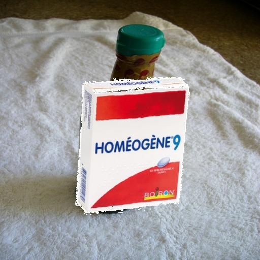

# PillPy
"It should save lives." — At least they told us so.

# Notes:
- Data omitted (files are mostly empty). 

# Recognition pipeline architecture:

# Examples of generated dataset
It is a bit crude, but some boxes contain full

